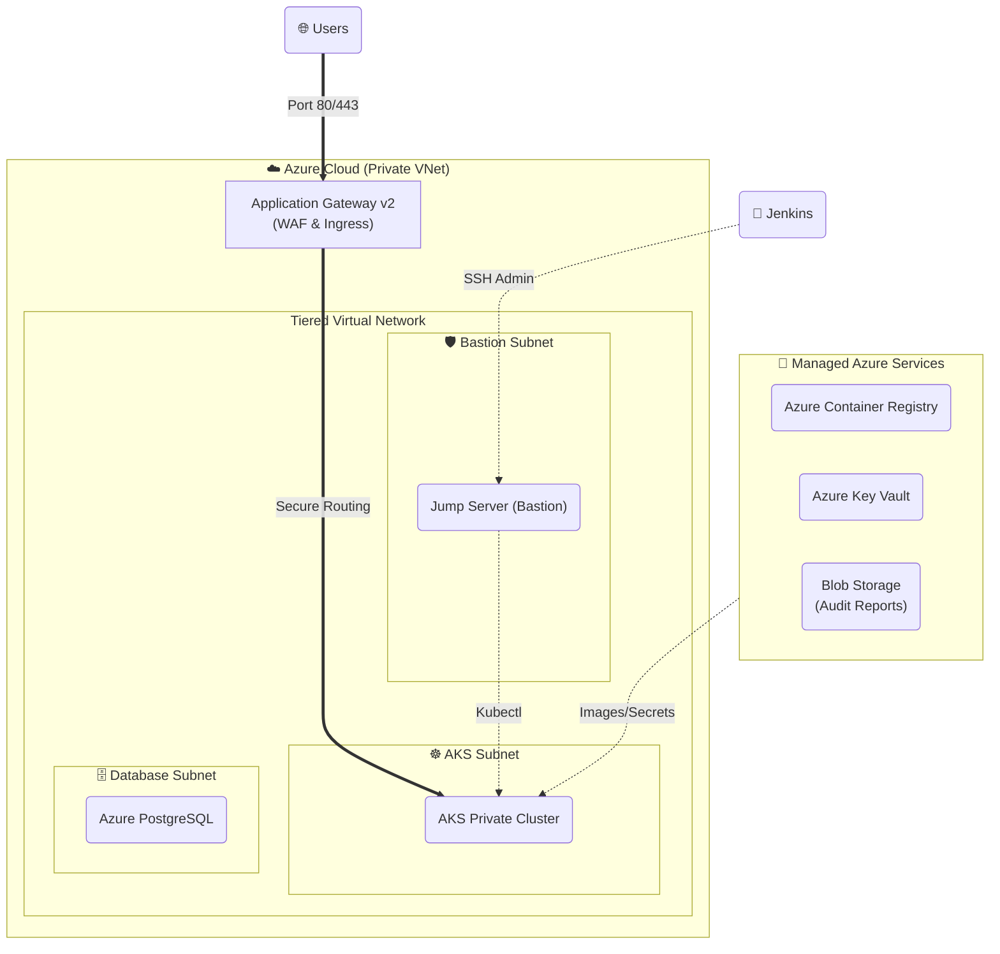

# 🛡️ Enterprise Azure DevSecOps Platform

Welcome to the **Enterprise Azure DevSecOps Platform**. This project demonstrates a production-ready, fully automated DevSecOps ecosystem for deploying multi-tier microservices to **Azure Kubernetes Service (AKS)**. It integrates **Jenkins** for orchestration, **Terraform** for immutable infrastructure, and a rigorous "Shift-Left" security strategy.

## 🌟 Platform Highlights

*   **Continuous Security Gates:** Automated scanning for Secrets (**Gitleaks**), Infrastructure misconfigurations (**Checkov**), Dependencies (**Dependency-Check**), and Container images (**Trivy**).
*   **Zero-Trust Secrets Management:** No static secrets in volumes or env vars. Credentials are tied to **Azure Key Vault** and injected into workloads via the **Secrets Store CSI Driver**.
*   **Immutable Promotion:** Artifacts are built once in `dev` and promoted (re-tagged) to `qa`, `uat`, and `prod`, ensuring "Build Once, Deploy Anywhere" parity.
*   **Private Infrastructure:** The AKS control plane and Node pools reside in private subnets, accessible only through a controlled **Jump Server** (Bastion).
*   **FinOps Optimization:** Dense pod packing and ephemeral environment lifecycles (automated teardown) to minimize cloud spend.

---

## 🏗️ Architecture & Network Layout

The platform utilizes a secure, tiered Virtual Network (VNet) topology to isolate management, application, and data layers.

### Infrastructure Topology

---

## 🚀 Getting Started

### Prerequisites
1.  **Azure Subscription:** Owner/Contributor level access.
2.  **Jenkins Environment:** Must have `terraform`, `az cli`, `docker`, and security tools installed.
3.  **SonarQube:** (Optional) For advanced code quality metrics.

### Deployment Sequence
1.  **Infrastructure:** Run `cicd/terraform/Jenkinsfile`. (Wait ~15m for full provisioning).
2.  **Security Glue:** Retrieve the Jump Server IP and set the `JUMP_SERVER_IP` credential in Jenkins.
3.  **Workloads:** Deploy in order: `Database` -> `Backend` -> `Worker` -> `Frontend`.

---

## 🛡️ Security Deep-Dive

### 1. Shift-Left Pipeline
Every commit triggers a parallel suite of scanners. If a **Critical** vulnerability is detected in a library or a secret is found in code, the build fails and no image is pushed to the registry.

### 2. Identity & Access (RBAC)
*   **Service Principals:** Used by Jenkins for infra management and ACR pushing.
*   **Managed Identities:** AKS nodes use `SystemAssigned` identities to pull images and read secrets, removing the need for password-based service accounts within the cluster.

### 3. Network Hardening
NSGs (Network Security Groups) enforce strict rules:
*   **AKS Pods:** Restricted from talking to the internet directly (Egress via NAT/Gateway).
*   **Database:** Only allows inbound traffic from the AKS internal IP range on Port 5432.

---

## 📊 Cost Management (FinOps)
*   **Disposable Environments:** Automated Jenkins jobs to `destroy` the environment on Friday and `apply` on Monday.
*   **Lean Workloads:** Every microservice uses resource limits (e.g., `20m CPU`) to optimize node density.

---

## 📂 Repository Structure
*   `app/`: Microservices source code (React/Flask).
*   `infra/terraform/`: Modularized HCL for all Azure resources.
*   `cicd/`: Pipeline as Code (Jenkinsfiles).
*   `kubernetes/`: Secured YAML manifests for AKS delivery.
*   `security/`: Global security policies and scan configurations.
