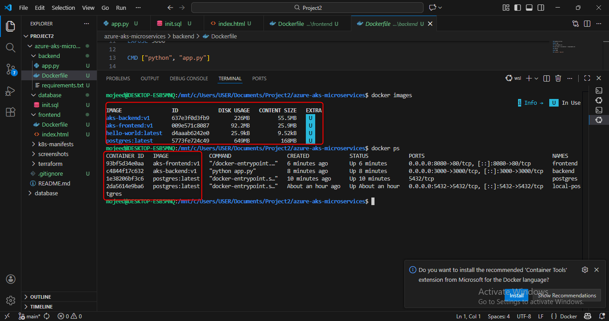
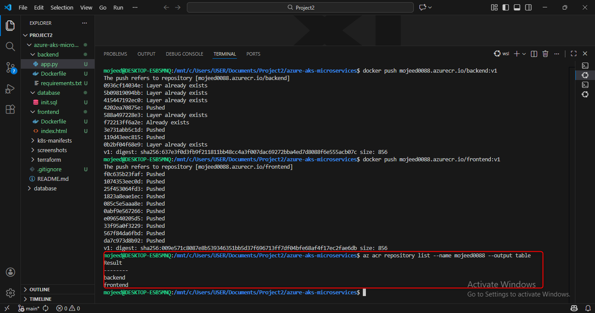
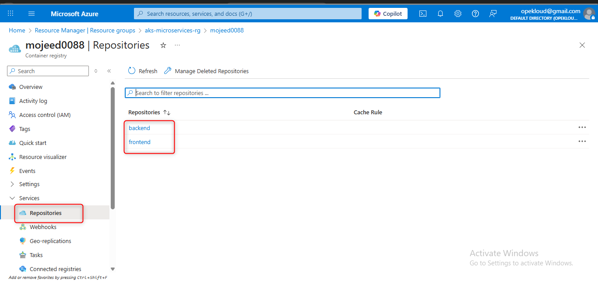
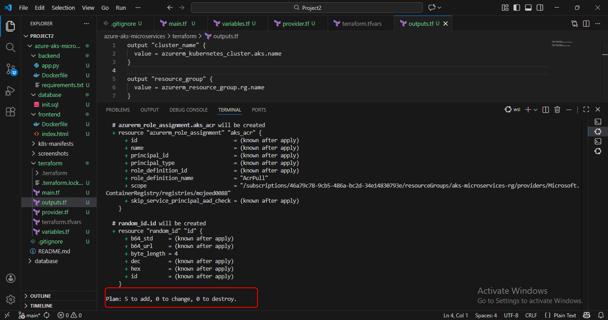
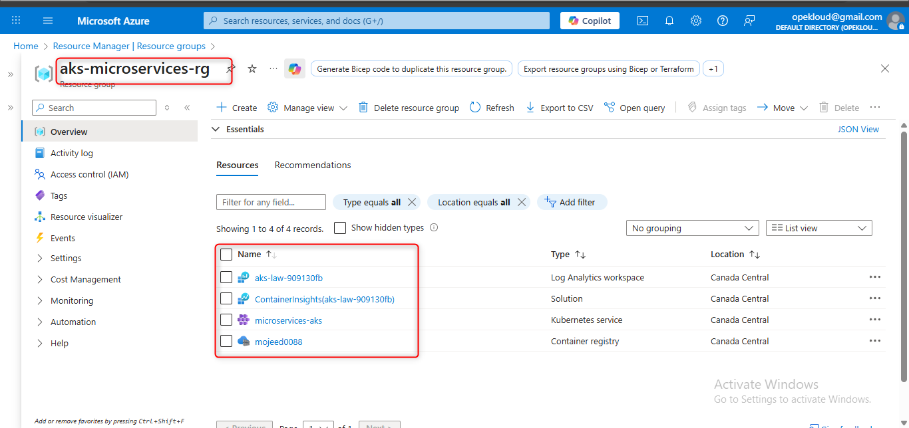
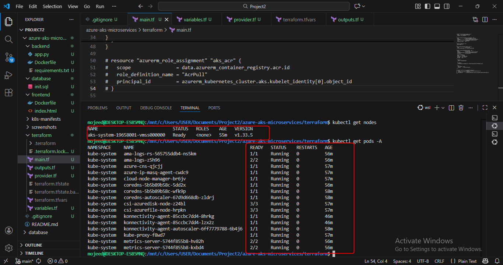
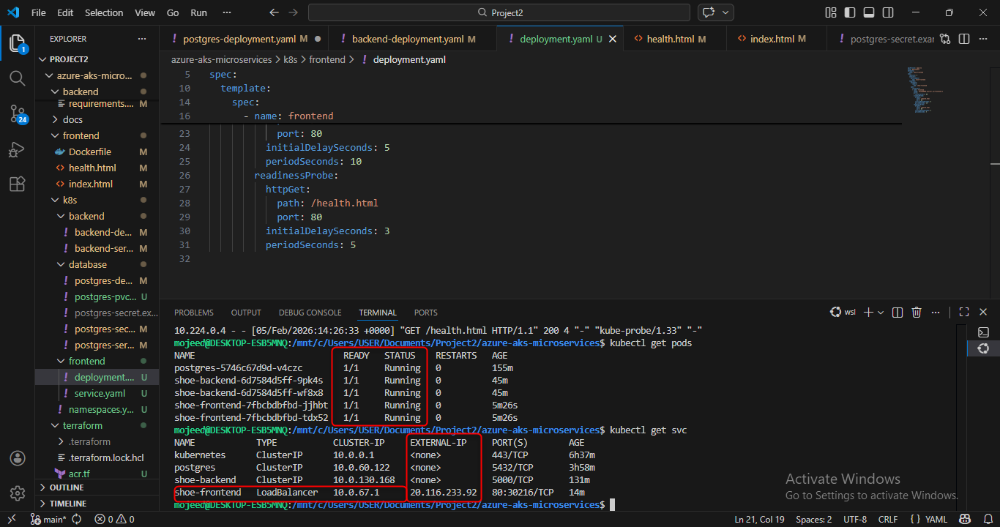
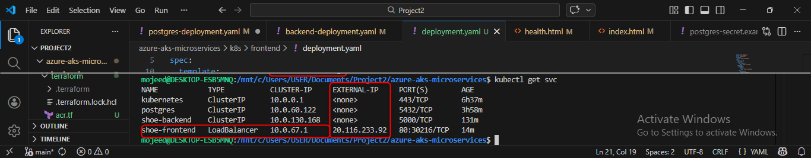
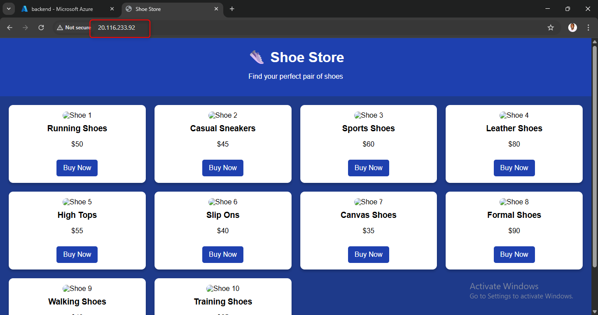

# Azure Kubernetes Service (AKS) Microservices Architecture Deployment

This project demonstrates deploying a containerized microservices application on **Azure Kubernetes Service (AKS)** using **Docker, Azure Container Registry (ACR), and Terraform**.

The application consists of:

- **Frontend** – HTML/CSS web application  
- **Backend** – Python REST API  
- **Database** – PostgreSQL  

---

## Architecture Overview

- Azure Kubernetes Service (**AKS**) deployed in **Canada Central**
- Azure Container Registry (**ACR**) for container image storage
- Microservices deployed into a dedicated Kubernetes namespace
- Frontend exposed using a **LoadBalancer** service
- Backend and Database exposed internally using **ClusterIP**

---

## Deployment Guide

### Build Docker Images

- docker build -t mojeed0088.azurecr.io/frontend:v1 ./frontend
- docker build -t mojeed0088.azurecr.io/backend:v1 ./backend

Built & containerized images
   


## Push Images to Azure Container Registry

- docker push mojeed0088.azurecr.io/frontend:v1
- docker push mojeed0088.azurecr.io/backend:v1

Images in ACR






## Provisioned Azure Kubernetes Services (AKS) with Terraform

- terraform plan


- terraform apply



## Deploy to Kubernetes

- Apply the Kubernetes manifests in order:
- kubectl apply -f k8s/database/
- kubectl apply -f k8s/backend/
- kubectl apply -f k8s/frontend/


## AKS Nodes and Pods After deployment

kubectl get nodes 


kubectl get pods



## Service Access

- Frontend: Exposed via LoadBalancer (External IP)
- Backend: Internal ClusterIP service
- Database: Internal ClusterIP service

Service IPs



## Application Access

Browser image



## Key Skills Demonstrated

- Azure Kubernetes Service (AKS)
- Azure Container Registry (ACR)
- Docker & Containerization
- Kubernetes (Deployments, Services, Namespaces)
- Infrastructure as Code with Terraform
- Microservices Architecture
- Cloud Networking & Load Balancing


## Repository Structure

    ```
    azure-aks-microservices
    ├── README.md
    ├── backend
    │   ├── Dockerfile
    │   ├── app.py
    │   └── requirements.txt
    ├── docs
    │   ├── azurecr-repository.png
    │   ├── docker-images.png
    │   ├── frontendapp-running-aks.png
    │   ├── kubectl-get-node-screenshot.png
    │   ├── pods-running-screenshot.png
    │   ├── repository-image.png
    │   ├── resources-in-azure.png
    │   └── terraform-plan-image.png
    ├── frontend
    │   ├── Dockerfile
    │   ├── health.html
    │   └── index.html
    ├── k8s
    │   ├── backend
    │   │   ├── backend-deployment.yaml
    │   │   └── backend-service.yaml
    │   ├── database
    │   │   ├── postgres-deployment.yaml
    │   │   ├── postgres-pvc.yaml
    │   │   ├── postgres-secret.example.yaml
    │   │   ├── postgres-secret.yaml
    │   │   └── postgres-service.yaml
    │   ├── frontend
    │   │   ├── deployment.yaml
    │   │   └── service.yaml
    │   └── namespaces.yaml
    └── terraform
        ├── acr.tf
        ├── main.tf
        ├── outputs.tf
        ├── provider.tf
        ├── terraform.tfstate
        ├── terraform.tfstate.backup
        ├── terraform.tfvars
        └── variables.tf

  

Certifications

• AZ-104 – Microsoft Azure Administrator  
• KCNA – Kubernetes and Cloud Native Associate  
• FinOps Certified Engineer

