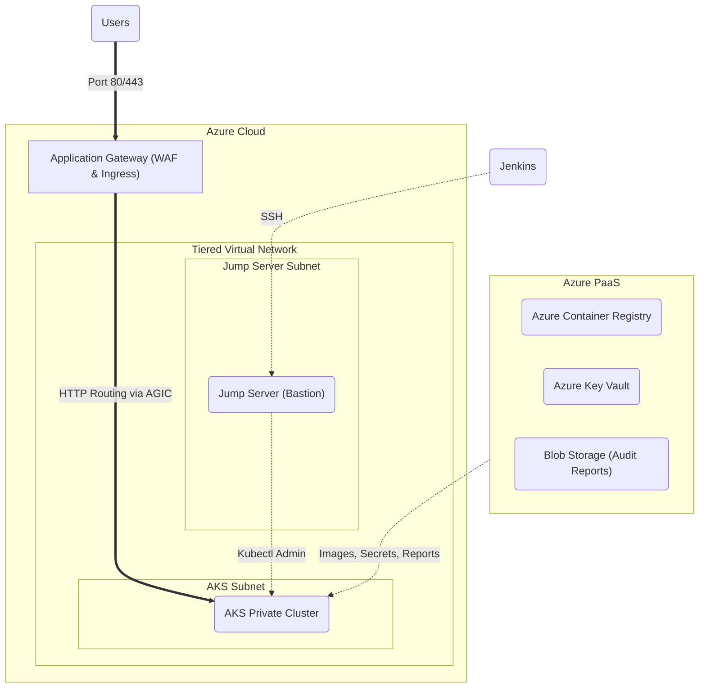

# Enterprise Azure DevSecOps Kubernetes Platform

Welcome to the Enterprise Azure DevSecOps Platform. This project demonstrates a production-ready, fully automated DevSecOps pipeline deploying a microservices application to Azure Kubernetes Service (AKS). It uses Jenkins for CI/CD, Terraform for immutable Infrastructure as Code, and integrates rigorous security scanning at every step of the software development lifecycle.

The primary objective of this platform is to enforce a "Secure by Default" and "Shift Left" mentality. We guarantee that code is structurally secure, free of leaked secrets, dependencies are patched, and containers are scanned for vulnerabilities before they are ever allowed to execute in the Azure cloud.

---

## 1. Architecture Overview

This platform dynamically provisions a secure, tiered Azure environment using Terraform, and deploys applications using a zero-downtime, automated footprint.

### Core Ecosystem Components:
- **Continuous Integration/Continuous Deployment (CI/CD):** Jenkins multi-branch pipelines
- **Infrastructure as Code (IaC):** Terraform with state management in Azure Storage
- **Container Orchestration:** Azure Kubernetes Service (AKS)
- **Ingress Controller:** Azure Application Gateway (WAF-enabled) via AGIC (Application Gateway Ingress Controller)
- **Image Registry:** Azure Container Registry (ACR) secured via Managed Identities
- **Secrets Management:** Azure Key Vault for dynamic, zero-trust credential injection
- **Network Isolation:** Tiered Azure Virtual Networks (VNet) with stringent Network Security Groups (NSGs)

---

## 2. Platform Highlights & Recent Upgrades

- **Fully Automated DevSecOps Pipeline:** Commits trigger automated scanning, building, and deployment across Dev, QA, UAT, and Prod.
- **Eternal Static IPs:** Terraform managed automated creation (via Azure CLI) of Static Public IPs for the App Gateway and Jump Server, allowing the underlying infrastructure to be destroyed and recreated blindly while maintaining absolute DNS stability.
- **Service Principal Authentication:** Transitioned from fragile docker-login credentials to robust Azure Service Principal authentication (`az acr login`) for pushing and pulling Docker images.
- **Cost-Optimized "Lean" Workloads:** Microservice resource constraints heavily optimized (10m-20m CPU, 32Mi-64Mi Memory limits) to allow dense multi-environment deployment on single, cost-effective AKS nodes.
- **Auto-Fallbacks for Promotion:** Pipelines default to the latest verified `dev` image for promotion if a specific Commit ID is omitted for QA/UAT/Prod environments.
- **Key Vault RBAC Stabilization:** Implemented deterministic `time_sleep` dependencies to ensure Azure RBAC propagates accurately before Key Vault secrets are injected, preventing 403 Forbidden race conditions.

---

## 3. Getting Started & Setup Guide

### Prerequisites

1. An **Azure Account** with sufficient privileges (Subscription Owner or Contributor + User Access Administrator).
2. A **Jenkins Server** (running locally or in the cloud) equipped with `git`, `docker`, `terraform`, `az cli`, `trivy`, `checkov`, `gitleaks`, and `dependency-check`.
3. A **SonarQube Server** accessible by Jenkins.

### Step-by-Step Deployment

1. **Clone the Repository:**
   ```bash
   git clone https://github.com/rajputganesh217/azure-aks-devsecops-platform.git
   cd azure-aks-devsecops-platform
   ```

2. **Configure Jenkins Credentials:**
   Navigate to *Manage Jenkins -> Credentials* and add the following as `Secret text`:
   - **Azure Credentials:** `AZURE_CLIENT_ID`, `AZURE_CLIENT_SECRET`, `AZURE_SUBSCRIPTION_ID`, `AZURE_TENANT_ID`.
   - **Database Credentials:** `POSTGRES_DB`, `POSTGRES_USER`, `POSTGRES_PASSWORD`.
   - **API Keys:** `sonar-token`, `NVD_API_KEY`.
   - **Networking:** `JUMP_SERVER_IP` (You will update this after Terraform runs).

3. **Deploy Infrastructure (Terraform):**
   - Run the `cicd/terraform/Jenkinsfile` pipeline in Jenkins.
   - Wait ~12 minutes for Azure network, AKS, App Gateway, Key Vault, and ACR to provision.
   - *Post-Provisioning:* Retrieve the new Jump Server Public IP from the Azure Portal and update your `JUMP_SERVER_IP` Jenkins credential. Update your local `/etc/hosts` file to point `microservices.local` domains to the new Application Gateway Public IP.

4. **Deploy Applications:**
   Execute these pipelines sequentially for the `dev` environment:
   - `cicd/database/Jenkinsfile` *(IMPORTANT: Check the `GENERATE_SECRET` box on this initial run!)*
   - `cicd/backend/Jenkinsfile`
   - `cicd/worker/Jenkinsfile`
   - `cicd/frontend/Jenkinsfile`

---

## 4. Architecture Flow & Network Layout

### Infrastructure Layout



### Application Traffic Flow
1. User requests `frontend.microservices.local`.
2. Traffic reaches the **Azure Application Gateway** (configured with a static Public IP).
3. The **AGIC (Application Gateway Ingress Controller)** routes traffic internally into the AKS `frontend` pods based on Kubernetes Ingress rules.
4. The `frontend` pods communicate internally to the `backend` Python API via Kubernetes ClusterIP.
5. The `backend` queries the isolated `PostgreSQL` Database Pod and occasionally dispatches async jobs to the `worker` pods.

---

## 5. DevSecOps CI/CD Pipeline

The Jenkins CI/CD process guarantees structural integrity and pristine application security.

1. **SCM Checkout & Environment Setup:** Pulls the repository and generates a tracking Commit ID.
2. **Security Scans (Parallel execution):**
   - **Gitleaks:** Scans the repository for hardcoded AWS keys, Azure tokens, or passwords.
   - **Dependency-Check:** Analyzes the `requirements.txt` or `package.json` against the NVD database for known CVEs.
   - **Checkov (Infra):** Scans Terraform explicitly for cloud misconfigurations.
   - **SonarQube (App):** Enforces high code quality and strict test coverage.
3. **Docker Build & Image Scan:**
   - Packages the app.
   - **Trivy:** Analyzes the actual Docker filesystem and OS layers for severe vulnerabilities. Stops the build if critical CVEs are present.
4. **Push to Registry:**
   - Authenticates using Azure Service Principal.
   - Pushes securely to Azure Container Registry (ACR).
5. **Continuous Deployment (CD):**
   - Connects to the isolated Jump Server via SSH.
   - Patches the Kubernetes manifests with the exact newly generated image tag.
   - Applies the changes to the AKS cluster seamlessly.
6. **Audit Upload:**
   - Uploads all generated security JSON/HTML reports directly to a secure Azure Blob Storage container (`devdevsecopsrep`) for compliance auditing.

---

## 6. Promotion Strategy

Images are exclusively built in the `dev` pipeline to ensure artifacts are fully immutable.
- **Format:** `{service-name}-{environment}-{commit-hash}` (e.g. `frontend-dev-7bd38a95`)
- When promoting to `QA`, Jenkins dynamically pulls the exact `dev` image from ACR, re-tags it for `QA`, and deploys it to the `qa` Kubernetes namespace.
- This guarantees "What was tested in Dev is EXACTLY what runs in Production."

---

## 7. Security Deep Dive

- **Zero Trust Secrets:** Applications do not hold passwords. Jenkins/Terraform leverages Azure Key Vault to generate passwords dynamically. The AKS CSI Driver safely mounts these secrets.
- **Roles Based Access Control (RBAC):** Every component operates on Least Privilege. Jenkins utilizes a Service Principal (`AcrPush` role). The AKS nodes utilize a Managed Identity (`AcrPull` and `Key Vault Secrets User`).
- **Network Isolation:** Operations (Jump Server), Web Traffic (App Gateway), and Workloads (AKS) reside in stringently separated Azure subnets, bound by exact NSG rules tracking inbound/outbound parity.
