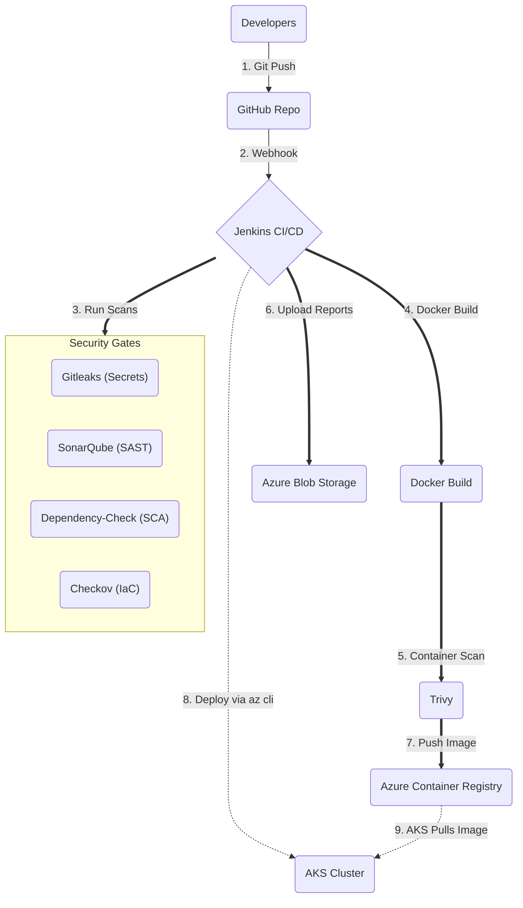
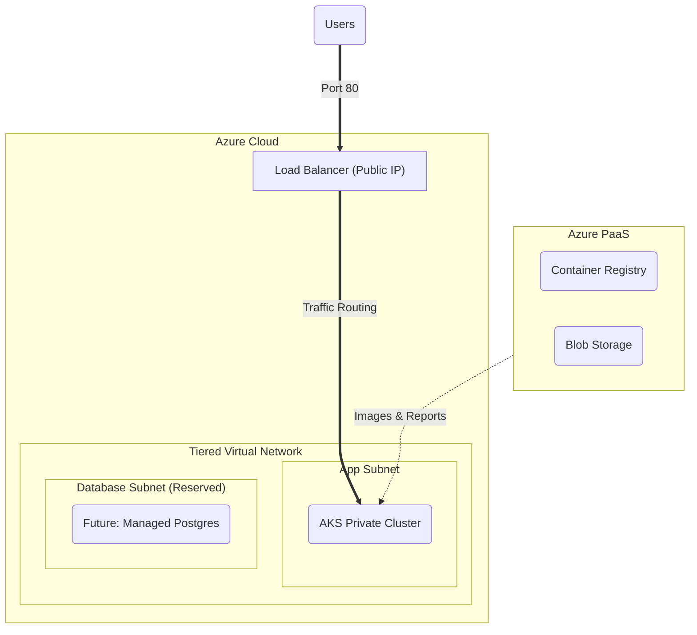
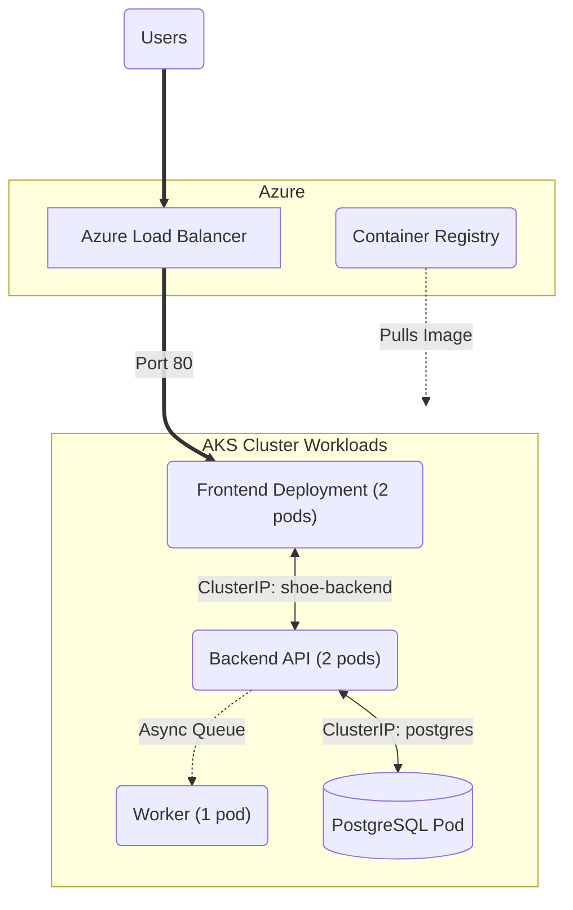

# Azure DevSecOps Kubernetes Platform

Hey everyone. This is a DevSecOps project I built to show how to deploy a standard microservices app to Azure AKS securely. It uses Jenkins for CI/CD, Terraform for the infrastructure, and integrates security scanning at every step of the pipeline.

The main idea here is to not just push code, but to make sure it's actually secure before it ever hits the cluster. We do secret scanning, static code analysis, library checks, and container scanning in the pipeline before the image even gets to Azure.

---

## Getting Started

If you want to spin this up yourself, here is how.

### What You Need

* An **Azure Account** with permissions to create stuff (Resource Groups, Service Principals).
* A **Jenkins Server**. You can run this locally or in the cloud. You'll need plugins like Pipeline, Docker, and SonarQube Scanner.
* Put these tools on your Jenkins agent: `terraform`, `az`, `docker`, `trivy`, `checkov`, `gitleaks`, `dependency-check`.
* A **SonarQube Server** running somewhere that Jenkins can reach.

### How to Run It

1. **Clone it:**
   ```bash
   git clone https://github.com/rajputganesh217/azure-aks-devsecops-platform.git
   cd azure-aks-devsecops-platform
   ```

2. **Set up your Jenkins Credentials:**
   Go to Manage Jenkins -> Credentials and add these as Secret Texts:
   * **Azure credentials**: `AZURE_CLIENT_ID`, `AZURE_CLIENT_SECRET`, `AZURE_SUBSCRIPTION_ID`, `AZURE_TENANT_ID`. (Also add them as `ARM_...` for Terraform to pick them up).
   * **Database credentials**: `POSTGRES_DB`, `POSTGRES_USER`, `POSTGRES_PASSWORD`.
   * **API Keys**: `sonar-token`, `NVD_API_KEY`, `azure-acr-credentials`.

3. **Run the Pipelines:**
   You have to run these in order the first time, otherwise the app won't have a database or a cluster to talk to:

   * First, run `cicd/terraform/Jenkinsfile`. (Sets up the VNet, AKS, and ACR).
   * Second, run `cicd/database/Jenkinsfile`. (Spins up Postgres and creates the k8s secrets).
   * Third, run `cicd/backend/Jenkinsfile`.
   * Fourth, run `cicd/worker/Jenkinsfile`.
   * Fifth, run `cicd/frontend/Jenkinsfile`.

Wait a few minutes after the frontend pipeline finishes, run `kubectl get svc shoe-frontend` to grab your public IP, and you're good to go!

---

## 1. CI/CD Pipeline Flow

Here is what happens when code gets pushed. We use Jenkins declarative pipelines to run everything. If any of the security scans fail, the pipeline stops.



1. We scan the code for hardcoded secrets (`Gitleaks`), bad dependencies (`Dependency-Check`), and code quality (`SonarQube`).
2. If that passes, we build the Docker container.
3. Before pushing it anywhere, `Trivy` scans the image for CVEs (even the Postgres third-party image).
4. If it's clean, we push it to Azure Container Registry (ACR).
5. All the reports (JSON, XML, txt) are zipped and pushed to an Azure Blob Storage container so we have a paper trail.
6. Finally, Jenkins safely proxies a kubectl command to AKS to update the deployments.

---

## 2. Infrastructure Architecture

I used Terraform to stand up the Azure networking and clustering. I kept the PaaS stuff outside the VNet and locked down the subnets inside the VNet.



* **Public Subnet:** Just the Azure Load Balancers created by Kubernetes.
* **App Subnet:** Where the actual AKS worker nodes live. No direct internet access allowed. Standard NSG isolation blocks it off. We explicitly allow the Azure Loadbalancer health probes to talk to the NodePorts.
* **DB Subnet:** Empty for now, but reserved for a future managed Azure DB instance.

---

## 3. Kubernetes Setup

Inside the cluster, here is how the workloads are laid out. The key thing here is that the database is running as a pod strictly internally, meaning you can't hit it from the internet at all.



---

## Key Security Practices

* **No Hardcoded Secrets:** Password and keys are pulled directly from Jenkins at runtime.
* **RBAC:** We use a Terraform Service Principal that only has exactly the permissions it needs (like `Storage Blob Data Contributor` for saving reports).
* **Managed Identities:** AKS nodes use managed identities to authenticate with Azure Container Registry. No docker login passwords hanging around.
* **Network Security Groups:** Traffic is strictly controlled between subnets.
* **Shift Left:** Code goes through 5 different security tools before it's allowed to run.

## Stack Summary

* **Cloud:** Azure
* **Infrastructure:** Terraform
* **Orchestration:** Azure Kubernetes Service (AKS)
* **Storage:** Azure Container Registry (ACR), Azure Blob Storage, Azure Log Analytics
* **CI/CD:** Jenkins, Git
* **Security Scanners:** SonarQube, OWASP Dependency-Check, Gitleaks, Trivy, Checkov
* **Database:** PostgreSQL

## What's Next?

If I were moving this into a real production environment, I'd probably add:
* **ZAP (DAST):** Run a dynamic application scan against the load balancer URL right after deployment.
* **Azure API Management:** Stick APIM in front of the cluster to handle rate limiting and OAuth.
* **External Secrets:** Move away from Jenkins injecting secrets and use the Azure Key Vault CSI driver so pods can mount secrets straight from the vault.
* **Managed DB:** Move Postgres out of a kubernetes pod and into a proper Azure Database for PostgreSQL.
