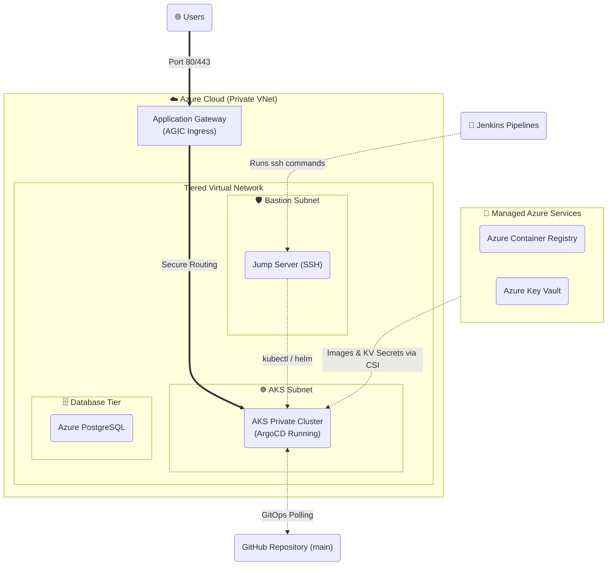

# 🛡️ Enterprise Azure GitOps & DevSecOps Platform


Welcome to the **Enterprise Azure DevSecOps Platform**. This repository dictates a production-ready, fully automated ecosystem for deploying isolated microservices to **Azure Kubernetes Service (AKS)**. 

Moving beyond traditional CI/CD, this architecture implements an elite **GitOps (ArgoCD)** deployment model, a **Universal Helm "App-Template"** architecture, and rigorous **Zero-Trust Secrets Management**.

---

## 🌟 Platform Highlights

* **GitOps Continuous Deployment (ArgoCD):** The cluster state is mathematically synchronized with the Git repository. Manual `kubectl` interference is automatically reconciled and obliterated via ArgoCD's `selfHeal: true` policy.
* **Universal Helm Architecture:** Replaces redundant chart folders with a single, highly dynamic `microservice` chart. The `platform` umbrella chart uses Helm aliases to rapidly stamp out Frontend, Backend, and Worker instances across 4 identical environments (`dev`, `qa`, `uat`, `prod`).
* **Zero-Trust Secrets Management:** 
  * Database passwords are probabilistically generated by Terraform and stored in Azure Key Vault.
  * AKS mounts the passwords directly into pod memory via the **Azure Key Vault CSI Driver** using User-Assigned Managed Identities. Handcoded passwords do not exist.
  * The Azure Jump Server relies on an out-of-band locally generated 4096-bit RSA SSH key pair.
* **Continuous Security Gates (Shift-Left):** 
  * **Checkov** scans Terraform IaC.
  * **Gitleaks** prevents hardcoded API key leaks.
  * **Trivy** performs deep OS-level image vulnerability scanning.
  * **Kube-Score** dynamically renders and enforces Kubernetes security primitives on Helm manifests.

---

## 🏗️ Architecture Layout

### Infrastructure Topology


---

## 🚀 Getting Started

### Prerequisites
1. **Azure CLI & Subscription:** Configured with Owner/Contributor access.
2. **Jenkins Server:** Preloaded with `terraform`, `checkov`, `trivy`, `gitleaks`, `helm`, and `kubectl`.
3. **Local SSH Key:** Run `ssh-keygen -t rsa -b 4096 -f ~/.ssh/aks_jump_key` on your host and manually inject the `.pub` file contents into the Terraform `tfvars` files before provisioning.

### Deployment Sequence (The Pipeline Playbook)
1. **Infrastructure (Terraform):** Run the `infra-terraform-pipeline` in Jenkins. This provisions the network, AKS, Key Vault, and ACR.
2. **Bootstrap (Database & ArgoCD):** Run the `database` Jenkins pipeline. 
   * It uses the secure Jump Server to install the Key Vault CSI bindings.
   * It natively bootstraps ArgoCD into the cluster.
   * ArgoCD instantly reads the `values-{env}.yaml` files and creates the app deployments.
3. **Microservices (Application Build):** Run the `backend`, `frontend`, and `worker` pipelines respectively. This will trigger Kube-Score scans, build the Docker images, push to ACR, and trigger ArgoCD to initialize the pods.

---

## 🛡️ Security Posture Details

* **Private Infrastructure:** The AKS Nodes reside in entirely private subnets. They cannot be pinged from the public internet. All traffic must ingress through the Azure Application Gateway.
* **Non-Root Execution:** The Universal Helm Chart forces all pods to drop root privileges (`fsGroup: 999` and `allowPrivilegeEscalation: false`).
* **Calico Default-Deny:** Internal lateral movement is blocked. Frontend can talk to Backend, Backend can talk to Postgres. Nothing else can cross-communicate.
* **Out-of-Band Key Rotation:** All legacy `keys/` and `cert/` directories have been purged securely via `.gitignore`. The cluster relies entirely on dynamic key generation.


---

## 📂 Repository Structure

```text
.
├── app/                  # Application Source Code
│   ├── backend/          # Flask API
│   ├── frontend/         # React SPA
│   └── worker/           # Python Background Worker
├── backend/              # 🔐 Terraform Remote Backend Configurations (.conf)
├── cicd/                 # Jenkins Pipeline Definitions (Jenkinsfiles)
├── infra/
│   └── terraform/        # Modular Azure Infrastructure logic & tfvars
├── kubernetes/
│   ├── argocd/           # ArgoCD Bootstrap Scripts & App-of-Apps config
│   └── charts/
│       ├── microservice/ # 🧠 The Universal "App-Template" Base Chart
│       ├── platform/     # Umbrella Chart (Aliasing Microservices)
│       └── postgres/     # PostgreSQL specific manifests
└── security/             # Global security policies and scan configurations
```
