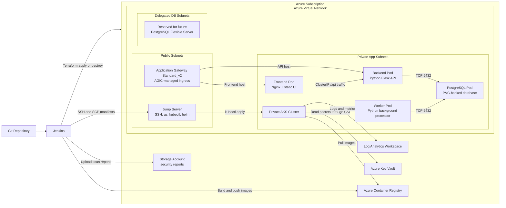
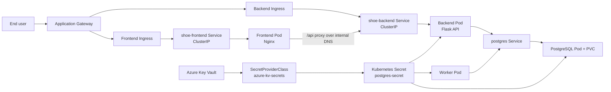

# Azure DevSecOps Kubernetes Platform

Secure Microservices Deployment Architecture on Microsoft Azure

## Document Control

| Version | Date | Description | Prepared For |
|---|---|---|---|
| 1.2 | 2026-03-15 | Factually validated and expanded project documentation | Ganesh Charawande |

## 1. Executive Summary

Modern application delivery requires security, repeatability, operational visibility, and automation across both infrastructure and runtime. Traditional release models often struggle with siloed teams, manual provisioning, inconsistent environments, and late discovery of security weaknesses.

This project addresses those problems by implementing a DevSecOps platform on Microsoft Azure that combines:

- Infrastructure as Code with Terraform
- CI/CD orchestration with Jenkins
- Container packaging with Docker
- Runtime orchestration on Azure Kubernetes Service (AKS)
- Centralized secret handling with Azure Key Vault
- Integrated security scanning across infrastructure, source code, dependencies, manifests, and images

The result is a private-cluster deployment model for a small microservices application in which infrastructure and application delivery are standardized, version-controlled, and auditable.

## 2. Solution Scope

The repository currently delivers a three-service application stack plus a database workload:

- Frontend: static HTML served by an unprivileged Nginx container
- Backend: Python Flask API
- Worker: Python background processor that polls and updates order records
- Database: PostgreSQL 15 deployed inside AKS with PVC-backed persistence

The Azure platform layer provisions the supporting services required to operate this stack securely:

- Azure Virtual Network with segmented public, private app, and delegated DB subnets
- Azure Application Gateway `Standard_v2`
- Private AKS cluster with Azure CNI and Calico network policy
- Azure Container Registry (ACR)
- Azure Key Vault
- Azure Storage Account for security reports
- Log Analytics Workspace
- Linux Jump Server for administration of the private cluster

## 3. Architecture Overview

### Architecture Diagram

Mermaid source: [architecture.mmd](mermaid/architecture.mmd)
Corrected visual asset: [devops-flow-corrected.svg](devops-flow-corrected.svg)

### Architecture Narrative

The platform follows a split-responsibility design:

- Source code and infrastructure code live in Git and act as the system of record.
- Jenkins orchestrates both infrastructure and application delivery.
- Terraform provisions the Azure landing zone and runtime dependencies.
- Application images are built or promoted through ACR.
- AKS runs the application in private subnets.
- The jump server provides the administrative bridge into the private cluster.
- Application Gateway plus AGIC publishes Kubernetes ingress rules externally.
- Azure Key Vault provides the secret source for workloads.
- Azure Storage Account and Log Analytics provide reporting and observability support.

## 4. Major Components

| Layer | Component | Role in this implementation |
|---|---|---|
| Source Control | GitHub | Stores application code, manifests, Terraform, and Jenkinsfiles |
| CI/CD | Jenkins | Runs infrastructure, database, frontend, backend, and worker pipelines |
| Infrastructure as Code | Terraform | Provisions Azure services through modular HCL |
| Registry | Azure Container Registry | Stores versioned images and supports promotion across environments |
| Container Platform | Azure Kubernetes Service | Runs the private cluster and application workloads |
| Secrets | Azure Key Vault | Stores sensitive values used by workloads and infra configuration |
| Secret Delivery | Secrets Store CSI Driver | Syncs Key Vault values into Kubernetes consumption paths |
| Ingress | Azure Application Gateway + AGIC | Routes external traffic to Kubernetes ingress backends |
| Admin Access | Jump Server | Hosts `az`, `kubectl`, Docker, and Helm for cluster administration |
| Reporting | Azure Storage Account | Stores archived scan reports from Jenkins pipelines |
| Observability | Log Analytics Workspace | Receives AKS monitoring data through the OMS agent |

## 5. Infrastructure Provisioning with Terraform

Terraform lives under `infra/terraform/` and is structured into reusable modules and an environment entrypoint under `infra/terraform/env/core`.

### 5.1 Core Infrastructure Managed by Terraform

The current implementation provisions or configures the following:

- Virtual network and subnet topology
- Network security groups and subnet associations
- Azure Container Registry
- Application Gateway `Standard_v2`
- Private AKS cluster
- Azure Key Vault with RBAC enabled
- Azure Storage Account for scan report archival
- Log Analytics Workspace
- Jump Server VM with managed identity
- Role assignments for AGIC, AKS pull access, jump server access, and Key Vault secret access

Important implementation note:

- The resource group is not created in this Terraform root module.
- It is consumed as a data source so the deployment aligns with a pre-existing resource-group standard.

### 5.2 Subnet Model

The VNet is organized into three subnet categories:

- Public subnets for the Application Gateway and jump server
- Private app subnets for AKS node placement and workload networking
- Delegated DB subnets reserved for future Azure Database for PostgreSQL Flexible Server adoption

Important implementation note:

- The repo prepares delegated DB subnets for a future managed PostgreSQL design.
- The current application database is still deployed inside AKS, not as Azure Database for PostgreSQL Flexible Server.

### 5.3 AKS Configuration Highlights

The AKS module currently enables:

- `private_cluster_enabled = true`
- Azure CNI networking
- Calico network policy
- Azure Policy integration
- Key Vault Secrets Provider integration
- OMS agent integration for Log Analytics
- System-assigned identity for the cluster
- Application Gateway Ingress Controller integration through the existing gateway

### 5.4 Jump Server Responsibilities

The jump server is a Linux VM used as the administrative bridge into the private cluster. Its bootstrap logic installs:

- Azure CLI
- `kubectl`
- `kubelogin`
- Docker
- Helm

It also authenticates with managed identity and retrieves AKS admin credentials so Jenkins can deploy indirectly through SSH.

### 5.5 Terraform Outputs

The current Terraform outputs expose useful operational values:

- cluster name
- resource group
- ACR login server
- Key Vault name
- jump server public IP

These outputs support operational handoff after provisioning, especially for updating Jenkins credentials such as `JUMP_SERVER_IP`.

## 6. Infrastructure Pipeline

The infrastructure pipeline is defined in `cicd/terraform/Jenkinsfile`.

### 6.1 Parameters

| Parameter | Values | Purpose |
|---|---|---|
| `ENVIRONMENT` | `dev`, `qa`, `test`, `uat`, `prod` | Selects the target environment |
| `ACTION` | `plan`, `apply`, `destroy` | Controls whether Terraform previews, applies, or tears down infrastructure |

### 6.2 Pipeline Stages

The pipeline performs the following sequence:

1. Prepare workspace and capture a short Git commit hash.
2. Run Checkov and Gitleaks in parallel.
3. Ensure static public IPs exist for the gateway and jump server.
4. Run `terraform init` with backend configuration.
5. Run `terraform fmt -check` and `terraform validate`.
6. Run `terraform plan` when applicable.
7. Pause for manual approval before `apply`.
8. Execute `terraform apply` or `terraform destroy`.
9. Upload security reports to the storage account.

### 6.3 Security Behavior in the Terraform Pipeline

The Terraform pipeline integrates security scanning, but its current behavior is intentionally tolerant:

- Checkov is configured with `soft-fail: true`.
- Gitleaks output is archived even when findings occur.
- The goal is auditability and early feedback, not absolute pipeline blocking in every case.

## 7. Application Delivery Pipelines

The application delivery model is implemented through three service pipelines:

- `cicd/frontend/Jenkinsfile`
- `cicd/backend/Jenkinsfile`
- `cicd/worker/Jenkinsfile`

### 7.1 Common Parameters

| Parameter | Values | Purpose |
|---|---|---|
| `ENVIRONMENT` | `dev`, `qa`, `uat`, `prod` | Target runtime namespace and image environment |
| `PROMOTE_COMMIT_ID` | string | Required for promotion workflows in higher environments |

### 7.2 Image Tagging Strategy

The pipelines generate tags in the format:

`service-environment-commit`

Example:

`backend-dev-7bd38a95`

This supports traceability and environment-aware promotion.

### 7.3 Dev Environment Flow

In `dev`, the application pipelines generally execute the following:

1. Prepare workspace and compute commit ID.
2. Run Gitleaks.
3. Run OWASP Dependency-Check.
4. Run kube-score on the Kubernetes manifests.
5. Build the Docker image.
6. Push the image to ACR.
7. Run Trivy on the image.
8. Render manifests using `envsubst`.
9. Copy manifests to the jump server over SCP.
10. Create the namespace if it does not already exist.
11. Apply manifests with `kubectl` from the jump server.
12. Wait for rollout completion.
13. Upload security reports to the storage account.

### 7.4 Higher Environment Promotion Flow

For `qa`, `uat`, and `prod`, the pipelines switch from build mode to promotion mode:

- The image is pulled from the previous environment tag.
- A new target tag is created.
- The promoted tag is pushed to ACR.
- The manifests are rendered and deployed through the jump server.

This keeps artifact content consistent between environments and avoids rebuilding the same source multiple times.

### 7.5 Deployment Method

Jenkins does not deploy directly into AKS from the controller using `az aks get-credentials` during the application pipeline.

Instead, the delivery flow is:

- render manifests locally on the Jenkins agent
- copy them to the jump server
- run `kubectl apply` from the jump server
- wait for deployment rollout status remotely

## 8. Database Pipeline

The database pipeline is defined in `cicd/database/Jenkinsfile`.

### 8.1 Parameters

| Parameter | Values | Purpose |
|---|---|---|
| `ENVIRONMENT` | `dev`, `qa`, `uat`, `prod` | Target namespace |
| `GENERATE_SECRET` | `true` or `false` | Controls whether the TLS secret should be created or recreated |

### 8.2 What the Database Pipeline Does

The database pipeline performs the following:

- prepares the workspace and report directory
- runs kube-score in `dev`
- optionally creates or recreates the TLS secret
- scans the `postgres:15` image with Trivy in `dev`
- deploys the SecretProviderClass, PVC, Deployment, and Service for PostgreSQL
- uploads reports to the storage account

Important implementation note:

- `GENERATE_SECRET` controls TLS secret generation.
- Database credentials are not generated by this step.
- The credentials are sourced from Azure Key Vault and synced into `postgres-secret`.

## 9. Kubernetes and Workload Architecture

### Kubernetes Workflow Diagram

Mermaid source: [k8s-workflow.mmd](mermaid/k8s-workflow.mmd)

### 9.1 Namespace Model

The application is deployed into environment-specific namespaces such as `dev`, `qa`, `uat`, and `prod`.

Important implementation note:

- The PostgreSQL workload is deployed in the same target environment namespace.
- It is not currently separated into a dedicated `db` namespace.

### 9.2 Frontend Workload

The frontend is a static site served by `nginxinc/nginx-unprivileged:alpine`.

Key behaviors:

- serves `index.html` and `health.html`
- runs on port `8080`
- exposes a `ClusterIP` service on port `80`
- uses a readiness and liveness probe on `/health.html`
- proxies `/api/` requests to the internal backend service `shoe-backend:5000`

### 9.3 Backend Workload

The backend is a Flask application that:

- exposes a root endpoint and a health endpoint
- writes shoe-order records into PostgreSQL
- reads database connection values from environment variables sourced from Kubernetes secrets
- runs with resource requests and limits
- uses HTTP health probes on `/health`

### 9.4 Worker Workload

The worker is a Python background process that:

- polls the `orders` table for pending work
- simulates asynchronous processing
- updates order status from `pending` to `completed`
- uses exec-based liveness and readiness probes
- reads its database connection settings from the same Kubernetes secret model as the backend

### 9.5 PostgreSQL Workload

The current database design is:

- image `postgres:15.5`
- single replica deployment
- PVC-backed storage
- internal Kubernetes service named `postgres`
- credentials delivered from Azure Key Vault through CSI and synced into `postgres-secret`

This design is valid for the current project implementation, but it is not equivalent to a managed Azure PostgreSQL service.

### 9.6 Resource Management and Scaling

The repository uses Kubernetes resource requests and limits rather than namespace-level `ResourceQuota` objects.

Current examples:

- frontend limits CPU to `50m` and memory to `64Mi`
- backend limits CPU to `100m` and memory to `128Mi`
- worker limits CPU to `100m` and memory to `128Mi`
- PostgreSQL limits CPU to `200m` and memory to `256Mi`

Horizontal Pod Autoscalers are defined, but the current settings cap workloads at `maxReplicas: 1`, which reflects a conservative development-stage operating profile rather than active elastic scale-out.

### 9.7 Network Policies

The repo includes Kubernetes `NetworkPolicy` definitions for the `dev` namespace. These policies provide:

- default deny behavior
- controlled frontend ingress
- backend access only from frontend pods
- PostgreSQL access only from backend and worker pods
- DNS egress allowance
- restricted egress from application pods to required destinations

Important implementation note:

- These policies are currently committed as `dev` namespace manifests.
- They are not yet templatized across all environments.

## 10. Security Architecture

### 10.1 Security Philosophy

The repository implements a practical DevSecOps model based on early scanning, centralized secrets, private networking, and least-privilege-oriented access patterns.

The current approach is best described as:

- security integrated into delivery workflows
- strong reporting and audit support
- selective soft-fail behavior for certain scanners during the current project phase

### 10.2 Infrastructure Security Controls

Implemented infrastructure controls include:

- private AKS control plane
- subnet segmentation across public, app, and reserved DB layers
- NSG-based traffic restrictions
- Azure CNI plus Calico network policy in AKS
- RBAC-enabled Azure Key Vault with purge protection
- system-assigned identity for AKS
- managed identity for the jump server
- role assignments for AGIC, ACR pull, Key Vault secret access, and AKS administration

Important implementation note:

- Application Gateway is currently `Standard_v2`.
- It should not be documented as WAF unless the Terraform module is changed accordingly.

### 10.3 Secret Management Model

Secrets are managed using a layered pattern:

- Azure stores the source secrets in Key Vault.
- The AKS Key Vault Secrets Provider is enabled in the cluster.
- The PostgreSQL manifest defines a `SecretProviderClass`.
- Key Vault values are synchronized into a Kubernetes secret named `postgres-secret`.
- Backend, worker, and PostgreSQL consume that secret.

This removes the need to hardcode database values inside application source files.

### 10.4 Pipeline Security Controls

The pipelines integrate several security tools:

- Gitleaks for repository secret detection
- Checkov for Terraform scanning
- OWASP Dependency-Check for third-party dependency review
- kube-score for Kubernetes manifest analysis
- Trivy for container image scanning

Current behavior notes:

- Several scan commands use `|| true`.
- Checkov is configured to soft-fail.
- Security results are archived to storage even when the pipeline continues.

This means the current pipeline design emphasizes visibility and feedback while preserving delivery flow for non-blocking findings.

### 10.5 Container Hardening

The workload manifests show several hardening controls:

- `allowPrivilegeEscalation: false`
- `runAsNonRoot: true`
- explicit non-root `runAsUser` values for application containers
- dropped Linux capabilities
- health probes for service resilience

## 11. Observability and Reporting

The platform uses two main reporting paths:

### 11.1 Azure Log Analytics

AKS monitoring is connected to Log Analytics through the OMS agent. This supports centralized operational visibility for the cluster environment.

### 11.2 Security Report Archival

Security reports generated by Jenkins are stored in two places:

- archived as Jenkins build artifacts
- uploaded to the Azure Storage Account for longer-lived auditing

This creates a basic compliance trail for security scan outputs across infrastructure and application delivery workflows.

## 12. Application Traffic Flow

### Traffic Flow Narrative

1. Users reach the application through the public IP attached to Application Gateway.
2. AGIC synchronizes Kubernetes ingress resources with Application Gateway listeners and routing rules.
3. Frontend traffic is sent to the `shoe-frontend` service.
4. Backend API traffic is sent to the `shoe-backend` service.
5. Inside the frontend container, Nginx proxies `/api/` requests to `shoe-backend:5000`.
6. The backend reads and writes order data in PostgreSQL.
7. The worker polls PostgreSQL and completes asynchronous order processing.

### Ingress Design Notes

The manifests currently define:

- `ingressClassName: azure-application-gateway`
- TLS references to `microservices-tls-secret`
- host-based routing using `${HOSTNAME}` placeholders rendered by the pipeline
- SSL redirect annotations for ingress traffic

## 13. Technology Stack

| Category | Technology |
|---|---|
| Cloud Provider | Microsoft Azure |
| Infrastructure as Code | Terraform |
| CI/CD | Jenkins |
| Container Build | Docker |
| Container Registry | Azure Container Registry |
| Orchestration | Azure Kubernetes Service |
| Ingress | Azure Application Gateway + AGIC |
| Secrets Management | Azure Key Vault + Secrets Store CSI Driver |
| Monitoring | Log Analytics Workspace |
| Secret Scanning | Gitleaks |
| IaC Scanning | Checkov |
| Dependency Scanning | OWASP Dependency-Check |
| Manifest Validation | kube-score |
| Image Scanning | Trivy |
| Frontend Runtime | Nginx serving static HTML |
| Backend Runtime | Python Flask |
| Worker Runtime | Python |
| Database | PostgreSQL 15.5 containerized in AKS |

Important implementation note:

- SonarQube variables exist in some Jenkinsfiles, but SonarQube is not currently wired into an active scan stage in this repo.

## 14. Deployment and Operations Guide

### 14.1 Required Jenkins Credentials and Inputs

A successful setup requires the Jenkins environment to provide the credentials used in the pipelines, including:

- `AZURE_CLIENT_ID`
- `AZURE_CLIENT_SECRET`
- `AZURE_SUBSCRIPTION_ID`
- `AZURE_TENANT_ID`
- `JUMP_SERVER_IP`
- `jump-server-ssh`
- `NVD_API_KEY`
- `POSTGRES_DB`
- `POSTGRES_USER`
- `POSTGRES_PASSWORD`
- `CSI_IDENTITY_CLIENT_ID`

### 14.2 Recommended Execution Order

For a fresh environment, the recommended order is:

1. Run the Terraform pipeline.
2. Review outputs and update Jenkins with the current jump server IP.
3. Run the database pipeline.
4. Run the backend pipeline.
5. Run the worker pipeline.
6. Run the frontend pipeline.

### 14.3 Environment Notes

There is one environment-model detail worth noting:

- the Terraform pipeline supports `test` in addition to `dev`, `qa`, `uat`, and `prod`
- the application delivery pipelines do not currently expose `test` as an environment choice

### 14.4 Operational Considerations

- The first database deployment may require `GENERATE_SECRET=true` to create the TLS secret.
- Promotion environments depend on a valid source image tag from the previous environment.
- The jump server remains a critical operational dependency for application deployment into the private cluster.

## 15. Known Limitations

The current implementation is strong for a project platform, but several limitations should be documented honestly:

- Application Gateway is `Standard_v2`, not WAF.
- Security scanners are integrated, but several stages are soft-fail rather than hard blocking.
- Network policies are committed mainly for the `dev` namespace.
- PostgreSQL is containerized inside AKS rather than operated as a managed Azure database.
- SonarQube is not yet active in the delivery pipelines.
- HPA objects exist, but current replica ceilings are intentionally fixed at `1`.

## 16. Future Enhancements

Reasonable next steps for the platform include:

- migrate PostgreSQL to Azure Database for PostgreSQL Flexible Server
- introduce active SonarQube scanning into application pipelines
- add OWASP ZAP or similar DAST tooling
- templatize or centrally manage network policies for all environments
- evaluate WAF-enabled Application Gateway if edge firewall features are required
- introduce GitOps tooling such as Argo CD for pull-based reconciliation

## 17. Mermaid Assets

The following documentation assets are maintained in this repository:

- [architecture.mmd](mermaid/architecture.mmd)
- [jenkins-pipeline.mmd](mermaid/jenkins-pipeline.mmd)
- [k8s-workflow.mmd](mermaid/k8s-workflow.mmd)
- [devops-flow-corrected.svg](devops-flow-corrected.svg)

## 18. Conclusion

This repository demonstrates a practical Azure DevSecOps platform that combines infrastructure provisioning, secure image delivery, private-cluster deployment, and operational reporting in a single workflow. Its design is especially strong in the areas of repeatable provisioning, environment-aware image promotion, private AKS administration through a jump host, and centralized secret handling through Azure Key Vault.

While some enterprise capabilities remain future enhancements, the current implementation already provides a credible, well-structured foundation for secure microservices delivery on Microsoft Azure.
