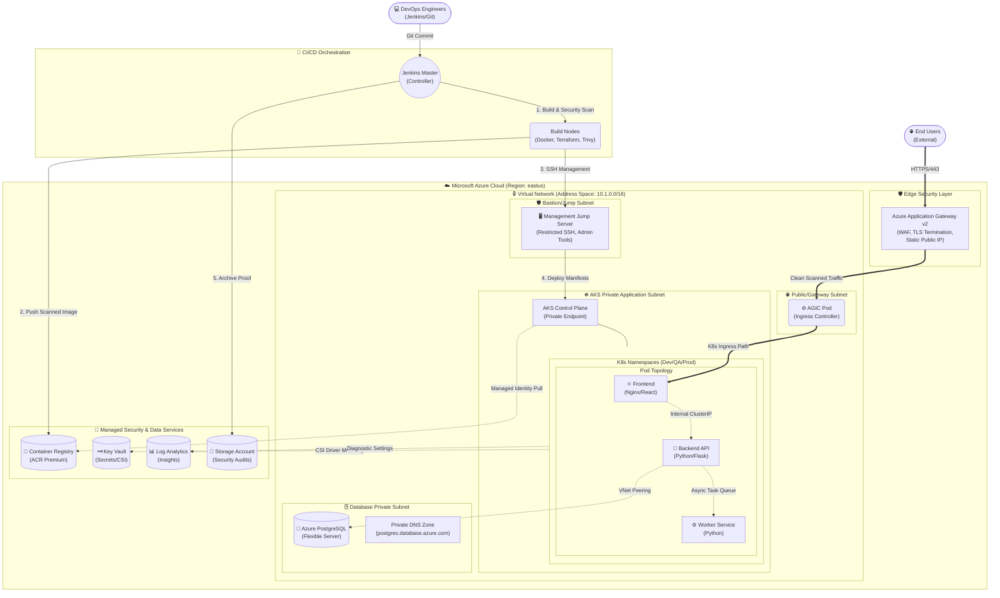
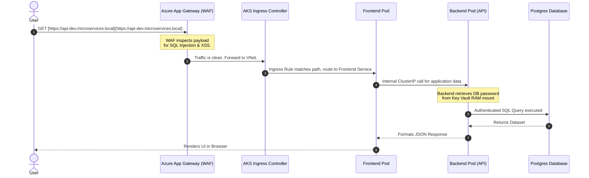
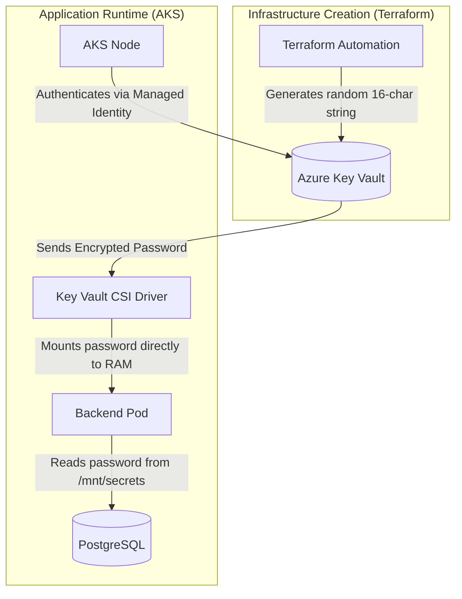

---

```markdown
# 🛡️ Enterprise Azure DevSecOps Kubernetes Platform


Welcome to the **Enterprise Azure DevSecOps Platform**. This project represents a state-of-the-art, production-grade implementation of a fully automated DevSecOps ecosystem. It bridges the gap between rapid software delivery and uncompromising security by embedding compliance, vulnerability management, and infrastructure as code (IaC) directly into the heart of the SDLC.

Utilizing **Jenkins** for orchestration, **Terraform** for immutable infrastructure, and a suite of specialized security scanners (**Gitleaks, Checkov, Trivy, Dependency-Check**), this platform deploys a multi-tier microservices application into a highly secured, private **Azure Kubernetes Service (AKS)** environment.

---

## 📑 Table of Contents
1. [Executive Summary & Business Value](#1-executive-summary--business-value)
2. [Universal Architecture (The Big Picture)](#2-universal-architecture-the-big-picture)
3. [Deep-Dive: The DevSecOps CI/CD Pipeline](#3-deep-dive-the-devsecops-cicd-pipeline)
4. [Application Traffic Flow & Security Layers](#4-application-traffic-flow--security-layers)
5. [Enterprise Security & Zero-Trust Architecture](#5-enterprise-security--zero-trust-architecture)
6. [Infrastructure as Code (Terraform Modularity)](#6-infrastructure-as-code-terraform-modularity)
7. [Comprehensive Repository Structure](#7-comprehensive-repository-structure)
8. [Deployment & Operational Guide](#8-deployment--operational-guide)
9. [Cost Management & FinOps Strategy](#9-cost-management--finops-strategy)
10. [Observability & Audit Compliance](#10-observability--audit-compliance)
11. [Future Roadmap & Advanced Capability](#11-future-roadmap--advanced-capability)

---

## 1. Executive Summary & Business Value

### The Legacy IT Challenge
In traditional SDLC models, organizations suffer from the "Wall of Confusion." Developers focus on speed, Operations focuses on stability, and Security focuses on risk. This fragmentation leads to:
* **Late-Stage Security Discoveries:** Vulnerabilities found right before launch cause delays and high remediation costs.
* **Manual Configuration Drift:** Environments (Dev, QA, Prod) slowly diverge, leading to "it works on my machine" failures.
* **Insecure Secrets Handling:** Hardcoded credentials and non-rotated keys create massive attack vectors.
* **Disaster Recovery Friction:** Rebuilding a complex cloud environment manually takes days of effort and is highly prone to human error.

### The DevSecOps Solution
This platform implements the core pillars of DevSecOps to eliminate these bottlenecks:
* **Infrastructure as Code (IaC):** 100% of Azure resources are defined in Terraform, enabling idempotent deployments and full disaster recovery in under 15 minutes.
* **Security "Shift-Left":** Five distinct security scanners intercept vulnerabilities in code, dependencies, and infrastructure before they ever reach a container registry.
* **Immutable Artifacts:** Utilizing Git Commit Hashes as image tags across all environments ensures that what was tested in QA is exactly what runs in Production.

---

## 2. Universal Architecture (The Big Picture)

This diagram illustrates the multi-tier cloud topology. It highlights the strict separation of concerns between the Public Internet, Edge Security (WAF), Private Networking, and Managed PaaS services.



---

## 3. Deep-Dive: The DevSecOps CI/CD Pipeline

Our pipeline is built on the principle of **Continuous Security**. Every build triggered in Jenkins follows a rigorous 8-stage gate system. If any gate fails (e.g., a critical vulnerability is found), the pipeline is **terminated immediately**, preventing insecure code from reaching Azure.

```mermaid
flowchart LR
    Start(["Developer Git Push"]) --> Checkout["1. Checkout SCM<br/>Generate Hash"]
    
    subgraph SecurityGates ["🛡️ Parallel Security Scanning (Shift-Left)"]
        direction TB
        Gitleaks["Gitleaks<br/>(Hardcoded Secret Scan)"]
        DepCheck["Dependency Check<br/>(Open-Source CVEs)"]
        Sonar["SonarQube<br/>(SAST & Code Quality)"]
        Checkov["Checkov<br/>(Terraform IaC Scans)"]
    end
    
    Checkout --> SecurityGates
    SecurityGates --> Build["2. Docker Build<br/>(Package App)"]
    Build --> Trivy["3. Trivy Scan<br/>(Container OS Vulnerabilities)"]
    
    Trivy --> Push[("4. Push to ACR<br/>(via Service Principal)")]
    Push --> Deploy["5. Secure Deploy<br/>(via Jump Server SSH)"]
    Deploy --> Upload["6. Audit Archive<br/>(Send Reports to Blob)"]
    Upload --> Finish(["✅ Pipeline Success"])
    
    %% Fail states
    SecurityGates -.->|Vulnerability Found| Fail(["❌ Pipeline Failed"])
    Trivy -.->|Critical OS CVE| Fail

```



| Stage | Tool | Description |
| --- | --- | --- |
| **1. Pre-Build Analysis** | **Gitleaks** | Scans the entire Git history for high-entropy strings, regex matches for Azure/AWS keys, and common password patterns. |
| **2. Code Quality (SAST)** | **SonarQube** | Analyzes source code logic to find code smells, bugs, and security hotspots (e.g., unsanitized inputs). |
| **3. Dependency Scan (SCA)** | **Dependency-Check** | Cross-references `requirements.txt` and `package.json` against the **NVD (National Vulnerability Database)** to find vulnerable 3rd-party libs. |
| **4. Infra Scanning** | **Checkov** | Evaluates Terraform HCL files against 1000+ best-practice policies (e.g., ensuring "Public Access" is disabled on Storage). |
| **5. Containerization** | **Docker** | Builds multi-stage, non-root Docker images to minimize the attack surface of the final artifact. |
| **6. Image Scanning** | **Trivy** | Performs a deep binary scan of the Docker image layers and OS packages (Alpine/Debian) for known CVEs. |
| **7. Secure Deployment** | **SSH / Kubectl** | Uses a secure Jump Server as a proxy to reach the private AKS API, ensuring no direct public access to the control plane. |
| **8. Compliance Audit** | **Azure Blob** | Automatically uploads JSON/HTML reports of all scans to a centralized storage account for long-term audit trails. |

---

## 4. Application Traffic Flow & Security Layers

We employ a strict Layer-7 routing approach to ensure only verified traffic interacts with our microservices.



1. **Edge Ingress:** External users resolve `frontend.microservices.local` to the Azure Application Gateway Static Public IP.
2. **WAF Filtering:** The Application Gateway (utilizing OWASP Core Rule Set) inspects traffic for SQLi, XSS, and Protocol violations.
3. **AGIC Routing:** The Application Gateway Ingress Controller (AGIC) pod in AKS synchronizes K8s Ingress rules with the Gateway, routing traffic to the internal `frontend` service.
4. **Service Resolution:** Traffic reaches the Frontend Pods (Nginx-unprivileged).
5. **Inter-Service Comm:** The Frontend calls the Backend API via internal Kubernetes DNS using ClusterIP.
6. **Data Persistence:** The Backend reads/writes to the Azure PostgreSQL Flexible Server. This server is locked to a private subnet via VNet Injection, meaning it is physically unreachable from the internet.

---

## 5. Enterprise Security & Zero-Trust Architecture

### Zero-Trust Secrets Management

At no point do human beings or application code hardcode passwords.



### Network Isolation and Identity (RBAC)

* **Network Isolation:** We utilize a 3-tier subnet architecture:
* **Gateway Subnet:** Public-facing, limited strictly to the App Gateway.
* **Application Subnet:** Private, contains AKS Nodes. Denies all inbound traffic except from the Gateway Subnet.
* **Database Subnet:** Private, restricted to inbound traffic from the Application Subnet only.


* **Identity (RBAC):** We use User-Assigned Managed Identities. The AKS cluster is granted the `AcrPull` role on the registry and `Key Vault Secrets User` on the vault, eliminating the need for shared service principal keys inside the cluster.
* **Static IP Stability:** Public IPs for the App Gateway and Jump Server are "Eternal" (managed outside the main cluster lifecycle) to ensure DNS records remain valid even during a full platform teardown and rebuild.

---

## 6. Infrastructure as Code (Terraform Modularity)

The environment is built using highly reusable, encapsulated modules. This allows us to rebuild the entire 52-resource environment in under 12 minutes.

* **`vnet`**: Configures Address Spaces, Subnets, and Network Security Groups (NSGs).
* **`aks`**: Provisions the Private Cluster, Node Pools, and Managed Identities.
* **`app_gateway`**: Sets up the L7 Load Balancer, WAF policies, and AGIC integration.
* **`db`**: Deploys PostgreSQL Flexible Server with Private DNS zone integration.
* **`keyvault`**: Configures the secure vault with RBAC-based access policies (utilizes deterministic `time_sleep` to prevent Azure RBAC race conditions).
* **`jump_server`**: Provisions an Ubuntu Bastion host with fixed networking for secure CI/CD access.

---

## 7. Comprehensive Repository Structure

```text
.
├── app/                        # Application Source Code
│   ├── frontend/               # React/Nginx Frontend
│   └── backend/                # Python/Flask API
├── cicd/                       # Jenkins Pipeline Definitions
│   ├── terraform/              # Infra Provisioning Pipeline
│   ├── frontend/               # Frontend CI/CD
│   ├── backend/                # Backend CI/CD
│   └── worker/                 # Worker CI/CD
├── infra/                      # Infrastructure as Code
│   └── terraform/
│       ├── env/core/           # Environment-specific tfvars & backend config
│       └── modules/            # Reusable Azure Resource Modules (AKS, VNet, etc.)
├── kubernetes/                 # K8s Manifests (YAML)
│   ├── frontend/               # Deployments, Services, Ingress
│   ├── backend/                # API Workloads
│   └── network-policies.yaml   # Zero-Trust Pod Networking Rules
├── security/                   # Security Configuration
│   ├── configs/                # Gitleaks, Checkov, Trivy config files
│   └── reports/                # (Generated) Local cache for security audits
└── docker/                     # Dockerfiles for all microservices

```

---

## 8. Deployment & Operational Guide

### Prerequisites

1. **Azure Service Principal:** With `Contributor` and `User Access Administrator` access at the subscription level.
2. **Jenkins Server:** Equipped with `az`, `terraform`, `docker`, and `ssh`.
3. **Storage Account:** To host the Terraform Backend State (`terraform.tfstate`).

### Execution Flow

1. **Provision Infra:** Run the `cicd/terraform/Jenkinsfile`. This builds the entire Azure network, security groups, and AKS cluster.
2. **Configure Bastion:** Retrieve the new Jump Server IP from the pipeline logs and add it to your Jenkins `JUMP_SERVER_IP` credential.
3. **Update Local DNS:** Add the new App Gateway IP to your `/etc/hosts` file.
4. **Deploy Database:** Run `cicd/database/Jenkinsfile` to initialize the PostgreSQL server. *CRITICAL: Check the `GENERATE_SECRET` parameter on the first run to populate K8s secrets and Key Vault.*
5. **Deploy Apps:** Execute the Backend, Worker, and Frontend pipelines sequentially.

---

## 9. Cost Management & FinOps Strategy

Running a full Enterprise DevSecOps environment 24/7 can be expensive. We architected this platform to support aggressive Cost Optimization.

* **Standard_D2s_v3 Nodes:** Balanced compute/memory ratio to minimize unused resources.
* **Resource Quotas:** Every Pod is capped at **20m CPU** and **64Mi RAM**, allowing us to run 50+ containers on a single small VM.
* **Ephemeral Lifecycle:** Because everything is defined as code, we use `terraform destroy` via Jenkins to wipe non-production environments daily or over the weekend. This saves up to **72% on compute costs** compared to 24/7 uptime.

---

## 10. Observability & Audit Compliance

We cannot manage what we cannot see. The platform includes native observability integrations.

* **Azure Log Analytics Workspace:** Acts as the central pane of glass. All Kubernetes control plane logs, application container `stdout`, and Application Gateway access metrics are routed asynchronously here.
* **Compliance Archiving (Blob Storage):** Every time a Jenkins pipeline runs, it generates thousands of lines of JSON and HTML security reports. The pipeline automatically uploads these to a secure Azure Blob Storage container (`devdevsecopsrep`) providing immutable proof of security posture for auditors.

---

## 11. Future Roadmap & Advanced Capability

Our architecture is constantly evolving to meet stricter compliance standards. Planned improvements include:

* **[ ] 100% Private PaaS:** Provisioning Azure Private Endpoints for the ACR, Key Vault, and Storage Account so internal traffic never touches the Microsoft public backbone.
* **[ ] Service Mesh (Istio):** To provide mutual TLS (mTLS) encryption for pod-to-pod communication.
* **[ ] GitOps (ArgoCD):** Shifting from Jenkins "Push" to an ArgoCD "Pull" model for state reconciliation and deployment reliability.
* **[ ] DAST Integration:** Adding OWASP ZAP to actively scan the running application in QA for session management and auth flaws.


